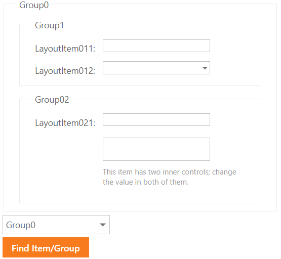

# Form Layout for ASP.NET Web Forms - How to find an item and access nested controls
<!-- run online -->
**[[Run Online]](https://codecentral.devexpress.com/e4579/)**
<!-- run online end -->

This example demonstrates how to find a layout item by its name and assign a value to a nested control.



## Overview

Create the [Form Layout](https://docs.devexpress.com/AspNet/DevExpress.Web.ASPxFormLayout) control, add item and group objects, and specify their [Name](https://docs.devexpress.com/AspNet/DevExpress.Web.LayoutItemBase.Name) properties.

```aspx
<dx:LayoutGroup Caption="Group1" Name="Group01">
    <Items>
        <dx:LayoutItem Caption="LayoutItem011" Name="LayoutItem011">
            <LayoutItemNestedControlCollection>
                <dx:LayoutItemNestedControlContainer ID="layoutContainer1" runat="server">
                    <dx:ASPxTextBox ID="ASPxTextBox1" runat="server" Width="170px" />
                </dx:LayoutItemNestedControlContainer>
            </LayoutItemNestedControlCollection>
        </dx:LayoutItem>
        <!-- ... -->
    </Items>
</dx:LayoutGroup>
```

To find a layout item by its name, call the control's [FindItemOrGroupByName](https://docs.devexpress.com/AspNet/DevExpress.Web.ASPxFormLayout.FindItemOrGroupByName(System.String)) method and pass the item's `Name` property value as a parameter.

```csharp
LayoutItemBase baseItem = layout.FindItemOrGroupByName(ASPxComboBox1.Value.ToString()) as LayoutItemBase;
```

To access a control placed in a layout item, use the [LayoutItem.Controls](https://docs.devexpress.com/AspNet/DevExpress.Web.LayoutItem.Controls) property. The code sample below traverses through the collection of nested controls and assigns new values to the controls.

```csharp
var layoutItem = (baseItem as LayoutItem);
foreach (var control in layoutItem.Controls) {
    ASPxEdit editor = control as ASPxEdit;
    if (editor != null)
        editor.Value = DateTime.Now;
}
```

## Files to Review

* [Default.aspx](./CS/Default.aspx) (VB: [Default.aspx](./VB/Default.aspx))
* [Default.aspx.cs](./CS/Default.aspx.cs) (VB: [Default.aspx.vb](./VB/Default.aspx.vb))

## Documentation

* [Item Manipulation](https://docs.devexpress.com/AspNet/14573/components/site-navigation-and-layout/form-layout/concepts/item-manipulation)
